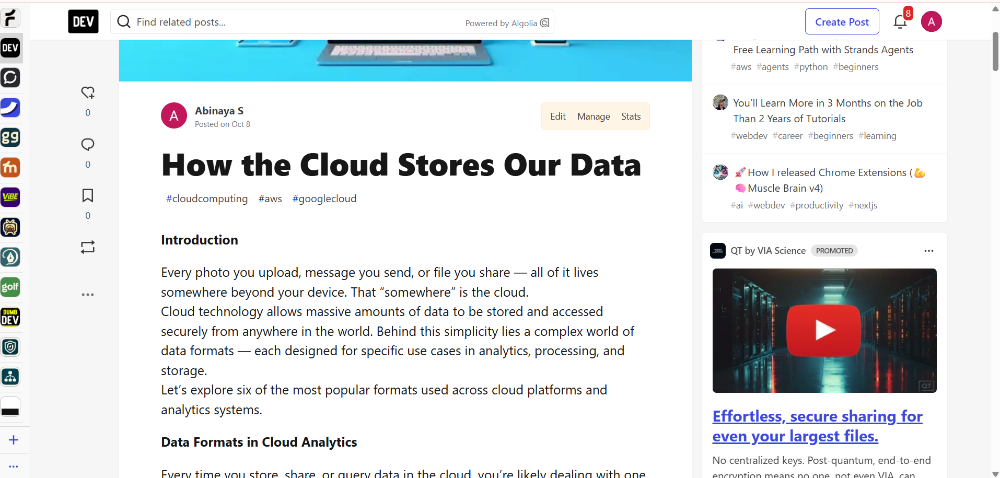
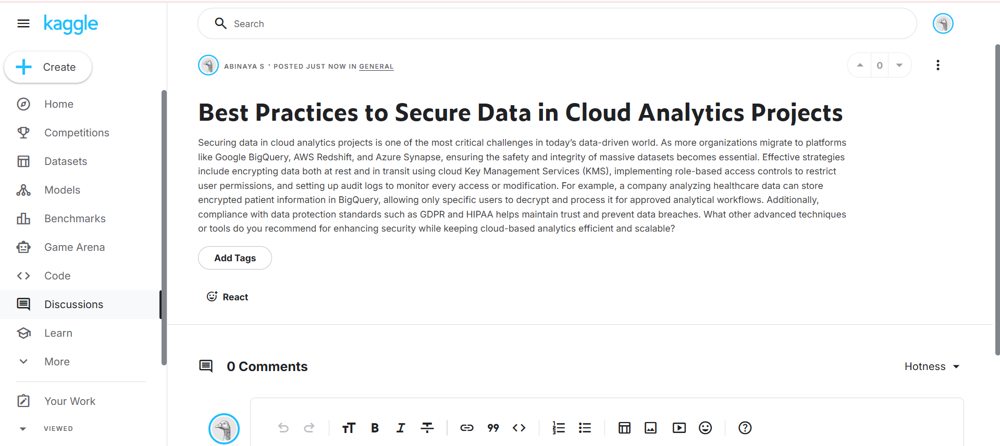
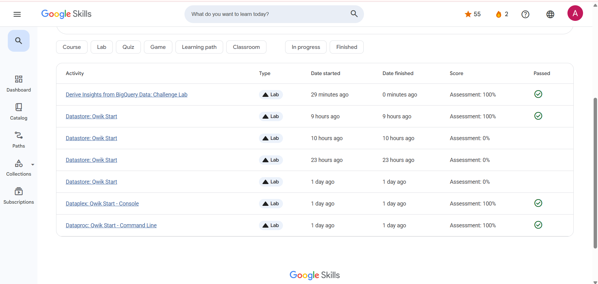
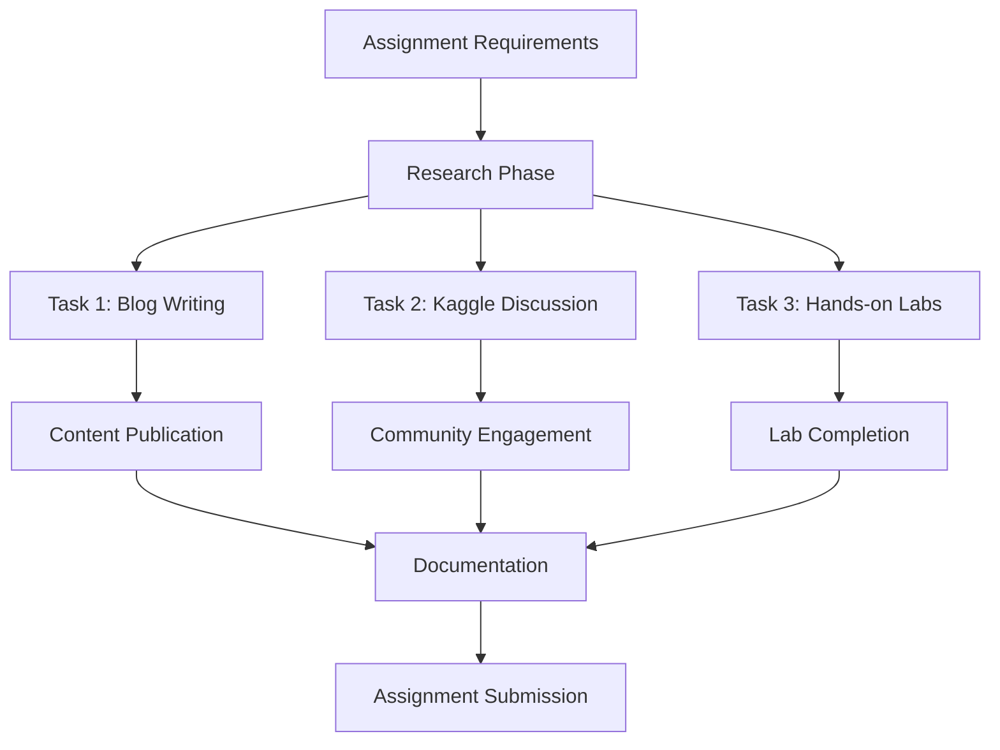

# Cloud Data Analytics Journey 

[](https://azure.microsoft.com/)
[](https://cloud.google.com/)
[](https://www.coursera.org/)

## Overview

This repository contains the comprehensive completion of *Assignment II* for the Data Analytics in Cloud Computing course. The assignment focuses on exploring cloud data concepts, understanding big data formats, and gaining hands-on experience with major cloud service platforms.

## Assignment Objectives

- *Explore Cloud Data Architecture*: Understanding how data is stored, processed, and managed in cloud environments
- *Big Data Format Analysis*: Comparative study of different data formats for cloud-based analytics
- *Practical Cloud Experience*: Hands-on implementation using industry-standard cloud platforms
- *Technical Communication*: Creating educational content for the developer community

## Tasks Overview

### 🔹 Task 1: Technical Blog Post - "How the Cloud Stores Our Data"

*Objective*: Create an educational blog post explaining cloud data concepts for analytics

*Deliverable*: Published technical article on dev.to platform

- *Title*: [How the Cloud Stores Our Data](https://dev.to/abinaya_s_258b79a0fee6073/how-the-cloud-stores-our-data-55ho)
- *Platform*: dev.to
- *Status*: Published
- *Live Link*: https://dev.to/abinaya_s_258b79a0fee6073/how-the-cloud-stores-our-data-55ho

*Key Topics Covered*:
- Cloud data storage architecture
- Data representation in cloud platforms
- Analytics-focused data management
- Cloud data accessibility and scalability

#### *Screenshots & Evidence*

<div align="center">

*Task 1 Completion Evidence*

Blog post publication and technical content on dev.to platform

</div>

---

### 🔹 Task 2: Kaggle Community Discussion - Parquet vs CSV Analysis

*Objective*: Initiate a technical discussion comparing file formats for big data analytics

*Deliverable*: Community discussion post on Kaggle

- *Title*: [The Battle of File Formats: Parquet vs CSV in Cloud Analytics](https://www.kaggle.com/discussions/general/615202)
- *Platform*: Kaggle Discussions
- *Status*: Published
- *Discussion Link*: https://www.kaggle.com/discussions/general/615202

*Analysis Focus*:
- *Performance Comparison*: Query speed and processing efficiency
- *Storage Optimization*: Compression ratios and storage costs
- *Columnar vs Row-based*: Architecture benefits for analytics
- *Cloud Integration*: Native support in major cloud platforms
- *Use Case Scenarios*: When to choose each format

#### *Screenshots & Evidence*

<div align="center">

*Task 2 Completion Evidence*

Kaggle discussion post on Parquet vs CSV analysis

</div>

---

### 🔹 Task 3: Google Cloud Skills - Hands-on Laboratory Experience

*Objective*: Complete practical labs to gain real-world cloud experience

*Platform*: Google Cloud Skills Boost

*Achievement: **100% Assessment Score* across all labs

#### Completed Labs:

| Lab Name | Platform | Status | Focus Area |
|----------|----------|---------|------------|
| *Derive Insights from BigQuery Data: Challenge Lab* | Google Cloud |  Completed | Data Analytics & SQL |
| *Datastore: Qwik Start* | Google Cloud | Completed | NoSQL Database |
| *Dataplex: Qwik Start - Console* | Google Cloud | Completed | Data Lake Management |
| *Dataproc: Qwik Start - Command Line* | Google Cloud | Completed | Big Data Processing |

####  Skills Acquired:
- *BigQuery*: Advanced SQL analytics on large datasets
- *Cloud Datastore*: NoSQL document database operations
- *Dataplex*: Unified data lake management and governance
- *Dataproc*: Managed Apache Hadoop and Spark clusters

#### *Lab Completion Screenshots*

<div align="center">

*Task 3 Completion Evidence*

Google Cloud Skills labs completed with 100% assessment scores

</div>

## Technical Architecture

```
Cloud Data Analytics Pipeline
├── Data Ingestion
│   ├── Batch Processing (Dataproc)
│   └── Real-time Streaming
├── Data Storage
│   ├── Structured (BigQuery)
│   ├── NoSQL (Datastore)
│   └── Data Lake (Dataplex)
├── Data Processing
│   ├── ETL Operations
│   └── Analytics Queries
└── Data Insights
    ├── Reporting
    └── Visualization
```

## Learning Outcomes

### Knowledge Gained:
- *Cloud Data Architecture*: Understanding of scalable data systems
- *File Format Optimization*: Performance implications of different formats
- *Google Cloud Platform*: Hands-on experience with GCP services
- *Big Data Processing*: Practical skills in data pipeline management
- *Technical Communication*: Ability to explain complex concepts clearly

###  Technical Skills Developed:
- BigQuery SQL optimization
- Cloud data pipeline design
- NoSQL database management
- Data lake governance
- Performance analysis and comparison

##  Project Workflow



## Impact & Results

- *Educational Content*: Created valuable resources for the developer community
- *Community Engagement*: Initiated meaningful technical discussions
- *Practical Skills*: Achieved 100% completion rate in all hands-on labs
- *Technical Analysis*: Provided data-driven insights on file format selection

## External Links & Resources

- *Blog Post*: [How the Cloud Stores Our Data](https://dev.to/abinaya_s_258b79a0fee6073/how-the-cloud-stores-our-data-55ho)
- *Kaggle Discussion*: [The Battle of File Formats: Parquet vs CSV in Cloud Analytics](https://www.kaggle.com/discussions/general/615202)
- *Google Cloud Skills*: [Skills Profile](https://www.skills.google/profile/activity)

## Author

*Abinaya S*
- Platform: [dev.to Profile](https://dev.to/abinaya_s_258b79a0fee6073)
- Kaggle: [Kaggle Profile](https://www.kaggle.com/)

## License

This project is part of an academic assignment and is intended for educational purposes.